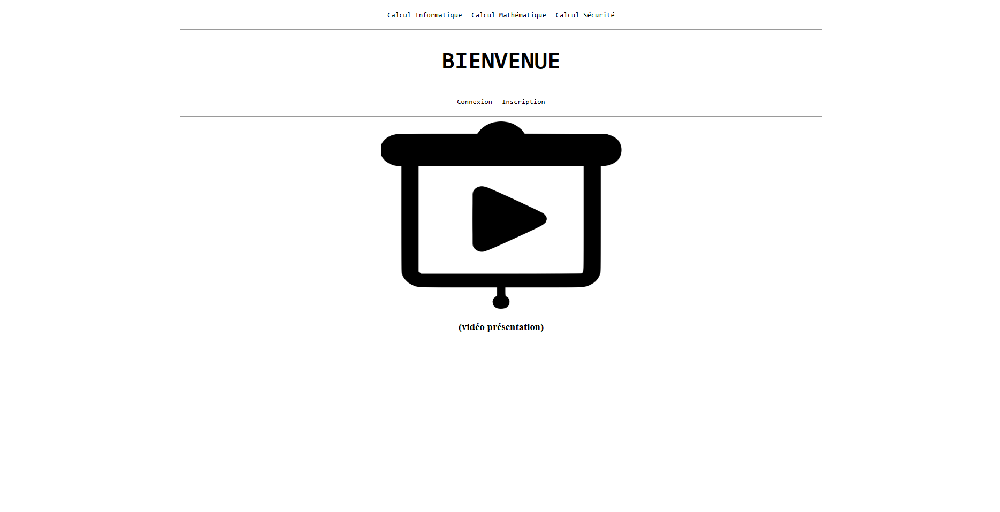
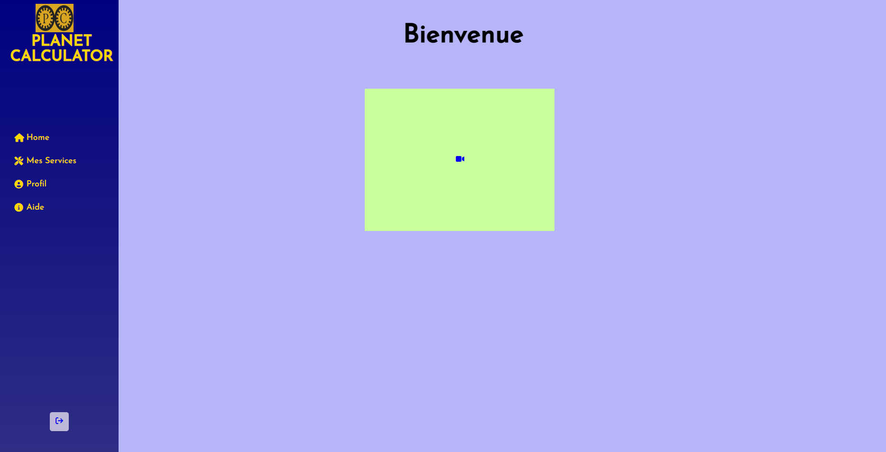
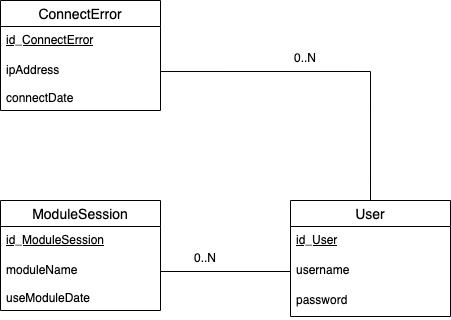
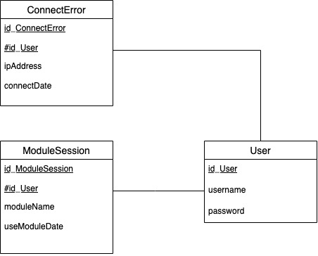

# Dossier de Conception
**Saé, Semestre 3, Année 2022-2023**
**IUT de Vélizy**,
*Adel Hammiche, Yanis Bouchaib, Paul Montagnac, Esteban Pagis*

## Sommaire:
1.  ### Introduction
2.  ### Contexte
3.  ### Maquettes
4.  ### Base de Données
5. ### Module Probabilités
6. ### Système d'Inscription
7. ### Système de Connexion

###

1. # Introduction
L’objectif de ce document est d’apporter du détail aux spécifications écrites dans l’annexe “Spécifications”. Il s’agit ici de comprendre comment sont réalisées les différentes fonctions associées au livrable en détail.
Nous rappellerons premièrement ce qui a été écrit dans le dossier de spécifications, ensuite nous parlerons en détail de la réalisation ainsi que de l’implémentation des maquettes.

2.  # Contexte
Dans l’annexe précédente “Spécifications” nous avons énoncé le contexte du projet ainsi que l’objectif mis en place pour ce livrable, ainsi que les pré-requis et priorités pour mener à bien l’accomplissement du livrable.

Nous allons maintenant détailler comment réaliser les différents objectifs associés aux différents cycles.

3.  # Maquettes 
	1. ## Maquettes Graphiques
		Pour réaliser les deux maquettes graphiques qui seront proposées au client, nous utiliserons l’application en ligne “Canva”, qui nous permet de réaliser plusieurs concepts et choix graphiques. Après plusieurs essais, nous en sommes arrivés au deux résultats suivants:
		
		*Maquette 1*
		
		*Maquette 2*
		Ces deux maquettes sont réalisées conformément aux spécifications écrites dans l’annexe 3.
		*\*Les différentes simulations autres que probabilités (mathématiques) ne seront pas réalisées, car l'équipe pédagogique a indiqué ne réaliser que la simulation de probabilité*

	2.  ## Maquette Web
		Après la sélection d'une maquette graphique, l’équipe l'implante sous forme de pages web.

		Étant donné que ces maquettes n’ont pas de fonctionnalités à proprement parler (inscriptions, simulations…), nous utiliserons HTML & CSS.

		Le critère de validation de cette maquette est l’affichage des pages ainsi qu’une navigabilité fonctionnelle (liaisons page-boutons), cette partie est détaillée dans l’annexe 6 “Tests”.

4. # Base de Données
	1. ## Données stockées
		Il est important au début de la conception d'une base de données de réfléchir aux données qui seront stockées dessus.

		L'application "Planet Calculator" repose sur le conception d'inscription / connexion de l'utilisateur, nous aurons donc des informations de connexion. 
		Attention, certaines exigences du RGPD (Réglement Général sur la Protection des Données) sur les données seront à prendre en compte lors de la suite du projet. Pour l'instant, l'exigence que nous allons prendre en compte est d'utilisateur uniquement les informations des utilisateurs.

		Pour cela, les données de connexion qui seront utilisées seront un **nom d'utilisateur (username)** ainsi qu'un **mot de passe (password)**, qui sera crypté en base de données.
		L'opération d'encryptage ne s'effectue pas en base de données mais en PHP, elle ne sera donc pas traitée dans ce livrable.
		**L'adresse IP** de l'utilisateur ainsi que sa **date de connexion** à l'application seront récoltées en plus en cas d'échec de connexion.

		Lors de l'utilisation d'un module (simulation), **l'username** ainsi que **le module utilisé** et **sa date d'utilisation** seront stockés en base.

		Nous déterminons les données suivantes à stocker:
		- username (login)
		- password
		- ipAddress
		- moduleName
		- useModuleDate
		- connectDate

		Dans la section suivante, nous définirons un modèle de table pour contenir toutes ces données.

	2. ## Modèle Conceptuel de données et Modèle Logique
		Les données étant définies, nous allons maintenant définir les tables qui seront utilisées sous forme d'un schéma conceptuel.
		
		Nous pouvons voir sur ce modèle conceptuel de données les 3 tables réalisées qui sont:
		- User
		- ModuleSession
		- ConnectError

		Les tables "ModuleSession" et "ConnectError" communiquerons avec la table "User" au travers d'une relation "0...N", en effet, un utilisateur peut avoir aucune comme plusieurs erreurs de connexion et plusieurs modules utilisés.

		Pour réaliser le modèle logique des données, nous retirerons les cardinalités et rajouterons la clé étrangère "id_User" pour effectuer la relation entre les tables.
		

	3.  ## Base de Données
		Le modèle de la base de données étant terminée, nous allons implanter ce modèle dans notre SGBD.

		Étant donnée que l'application web sera hébergée sur un Raspberry Pi, nous utiliserons le SGBD **MariaDB** pour mettre en place notre base de données. MariaDB est une version communautaire de MySQL, nous l'utiliserons car MySQL n'est plus pris en charge, cependant, MariaDB possède les mêmes commandes / syntaxe que MySQL. La base de données communiquera avec Apache pour la partie PHP. Les commandes utilisées pour installer MariaDB ou encore Apache2 sont disponibles dans le Rapport d'Installation Serveur.

		Il est important au moment de la création des tables et de ses attributs, de définir des contraintes, notamment de **non-nullité** et clé primaire (et étrangère pour ModuleSession et ConnectError). Une règle d'auto-incrémentation sera intégrée à l'ID.

		Voici le script réalisé en fonction de la syntaxe MySQL (MariaDB):

			CREATE TABLE User (
		      id_User INT NOT NULL AUTO_INCREMENT,
		      username VARCHAR(100) NOT NULL,
		      password VARCHAR(100) NOT NULL,
		      PRIMARY KEY (id_User)
		    );
		    
		    CREATE TABLE ConnectError (
		      id_ConnectError INT NOT NULL AUTO_INCREMENT,
		      id_User INT NOT NULL,
		      ipAddress VARCHAR(50) NOT NULL,
		      connectDate DATETIME NOT NULL,
		      PRIMARY KEY (id_ConnectError),
		      FOREIGN KEY (id_User) REFERENCES User(id_User)
		    );
		    
			CREATE TABLE ModuleSession (
		      id_ModuleSession INT NOT NULL AUTO_INCREMENT,
		      username VARCHAR(100) NOT NULL,
		      moduleName VARCHAR(30) NOT NULL,
		      useModuleDate DATETIME NOT NULL,
		      PRIMARY KEY (id_ModuleSession),
		      FOREIGN KEY (username) REFERENCES User(id_User)
		    );

		Le script est disponible avec sa documentation dans l'annexe 6: Programmation.
		Pour l'exécuter, il faut initialiser la Base de Données avec la commande
		 `CREATE DATABASE PLANETCALCULATOR`

5. # Module de Probabilités
	1. ## Réalisation des scripts python
		Le choix de réaliser le calcul de probabilité en Python se caractèrise par la facilité d'utilisation du langage pour ce type d'opérations, ainsi que sa facilité d'implémentation en PHP.

		À l'aide de l'énoncé fourni par M. Hoguin contenant les différentes méthodes de calculs avec les formules correspondantes. 3 méthodes ont été retenues:
		- Rectangle Gauche
		- Trapèze
		- Simpson

		Ces 3 méthodes sont ajoutées à 3 scripts python portant leur noms. Le script python associé sera exécuté en fonction du choix de l'utilisateur.
		
	2. ## Implémentation du module
		Le tout premier objectif a définir est d'implémenter les méthodes de calcul dans la page web. 
		
		Le langage que nous utiliserons pour traduire les calculs est python, son utilisation sera plus simple que PHP qui servira à implémenter le script.

		Étant donné que l'implentation de ce module est la premiere modification apportée à la structure du site, nous allons passer tout les fichiers qui étaient en HTML, en PHP.

		Nous allons créer un répertoire module_proba, qui est un sous-répertoire de utilisateur_inscrit, pour y placer le fichier module_proba.php, son css ainsi que les 3 scripts pythons qui seront exécutés pour calculer la probabilité P(X<t).

		L'implémentation et l'exécution du script ce fait de la manière suivante:
		Nous mettons en place un formulaire, qui permet à l'utilisateur de choisir parmis trois méthodes de calculs, ainsi que de rentrer les 3 valeurs du calcul, à savoir, la variance, l'écart-type et le seuil limite.

		Une fois ces valeurs rentrées et le formulaire envoyé, une condition en php permet de sélectionner le script python correspondant à l'aide de la méthode sélectionnée, et de l'exécuter avec les autres valeurs rentrées par l'utilisateur en arguments du script à l'aide de la méthode passthru(), qui permet d'exécuter un script externe (les commandes seront détaillées dans la documentation du code). Le résultat retourné sera directement affiché sous le bouton validé, étant-donné le choix de l'équipe de réaliser le traitement du formulaire sur la même page que celui-ci.

6. # Système d'Inscription
	1. ## Formulaire d'Inscription
		La conception de la page d'inscription peut se diviser en deux parties.

		Nous commençons d'abord par rendre fonctionnel le formulaire mis en place dans la maquette, pour cela, nous lui ajoutons une méthode POST qui sera traitée au travers d'un fichier traitement.php.

		Dans ce formulaire il y aura deux valeurs à remplir: l'username et le password. Ces deux valeurs seront soumises à des contraintes de longueur, ainsi que de caractères autorisés.

		Un captcha sera également mis en place, en prévention de bots et donc d'un éventuel "spam" d'inscriptions et de requêtes sur la base de données.
		Ce captcha sera fourni par Google reCaptcha, qui est une solution gratuite et pratique à mettre en place. Nous utiliserons le modèle "v2" et non "v3" car celui-ci permet de vérifier son utilisateur en cliquant sur les images correctes, tandis que le "v3" est juste une checkbox à remplir.
	2. ## Traitement
		Le traitement sera situé dans un fichier à part, celui-ci servira d'abord à vérifier la validité du captcha. Les méthodes de vérification du traitement seront écrites dans un fichier .php à part, pour ainsi les réutiliser dans les tests unitaires.

		En second temps, le traitement va permettre de consigner les valeurs dans la base de données. Avant d'inscrire le mot de passe, celui-ci sera encrypté. Une fois le cryptage et les vérifications de valeurs (longévité, caractères spéciaux...), celles-ci seront inscrite sur le Base de Données du Raspberry Pi, hébergant également le serveur web.

7. # Système de Connexion
	1. ## Formulaire de Connexion
		Un formulaire de connexion similaire au système d'inscription sera proposé dans la page de connexion, contenant un champ username, un champ password ainsi qu'un Google Captcha, qui sera utilisé pour éviter l'utilisation de bots, ou encore une attaque malveillante dite "bruteforce", consistant à essayer le plus de combinaisons de mot de passe possible automatique, à l'aide d'un dictionnaire, pour obtenir un mot de passe par la force.
	
	2. ## Traitement
		Le traitement effectué se fera également en base de données. Nous allons vérifier les valeurs entrées dans les champs, en fonction des contraintes, et ensuite faire une vérification en base de données pour que les deux champs correspondent, et possèdent le même mot de passe. 
		
		Pour commencer, la requête vérifiera que l'username est bien en base, s'il ne l'est pas alors l'utilisateur sera redirigé vers la page de connexion avec un message d'erreur. Si l'username est en base de données, alors une vérification de correspondance entre le mot de passe entré par l'utilisateur et le mot de passe consigné en base de données s'effectuera. Si les deux mots de passe correspondent, alors une variable SESSION d'identification sera attribué à l'utilisateur, ce qui lui permettra d'accéder au reste des pages de l'application. 

		L'utilisation d'une variable SESSION au lieu d'un cookie est essentielle. En effet, est stocké par le client et peut être facilement manipulée, elle n'est donc pas adapté au stockage d'identifiants. La variable de Session est stockée sur le serveur et ne peut pas être manipulée par l'utilisateur.

		L'utilisateur pourra se déconnecter à tout moment à l'aide d'un bouton, ce qui le redirigera à la page de connexion et détruira sa session actuelle.

	3. ## Page de Profil
		La page de profil sera pour l'instant simple et comportera un formulaire permettant à l'utilisateur de modifier son identifiant ainsi que son mot de passe, conformément aux contraintes imposées par le formulaire d'inscription et de connexion.
		Le traitement s'effectura également en base de données, ou l'on vérifieras le status de l'utilisateur et nous modifierons ses identifiants.

8. # Gestionnaire
	1. ## Création de l'utilisateur
	La création de l'utilisateur se fera en base de données, nous allons inscrire à l'aide du formulaire d'inscription de l'application web l'utilisateur ``gestionnaire`` avec le mot de passe ``gestionnaire92360``.
	Une fois l'utilisateur inscrit, nous rajoutons un script dans la page d'accueil permettant de rediriger le gestionnaire vers la page d'accueil Gestionnaire.

	2. ## Page d'accueil
	La page d'accueil du gestionnaire est accessible uniquement si la variable $_SESSION récupérée est égale à "gestionnaire". 
	Un utilisateur voulant accéder à la page d'accueil gestionnaire par l'url sera automatique redirigé à l'aide de la condition détaillée dans la documentation. Également, le gestionnaire voulant accéder à la page d'accueil utilisateurs sera aussi redirigé vers la page d'accueil gestionnaire, poru éviter d'éventuels conflits, étant donné que la page d'accueil gestionnaire propose également l'accès au module de probabilités en plus des fonctions supplémentaires.
	Celui-ci aura accès aux deux fonctions actuelles qui sont la liste des utilisateurs et les statistiques du module.

	3. ## Liste des utilisateurs
	La page "liste des utilisateurs" propose un affichage récursif des utilisateurs inscrits en base de données dans une table, à l'aide des données récupérées d'une requête SQL de sélection.

	Le gestionnaire pourra consulter le nom de l'utilisateur ainsi que de le supprimer à l'aide d'un bouton disposé à droite du nom d'utilisateur associé. Cliquer sur le bouton exécutera une requête SQL qui permettra de supprimer l'utilisateur demandé en base de données, à l'aide d'un script PHP.

	4. ## Statistiques du module
	La page "Statistiques" permet de consulter l'historique des utilisations du module probabilités.
	Ces utilisations sont classées dans un tableau contenant le nom de l'utilisateur, la méthode utilisée pour le calcul de probabilités ainsi que le date et heure actuelle.
	Un fichier CSV consignant toutes ces données peut être crée à l'aide d'un bouton "Générer le CSV". Le bouton "Générer un CSV" est issu d'un formulaire le contenant comme un élément unique. Quand l'utilisateur clique sur ce bouton, il est redirigé dans le script de traitement ``genererCSV.php`` à l'aide des attributs ``method=post, action=genererCSV.php``.