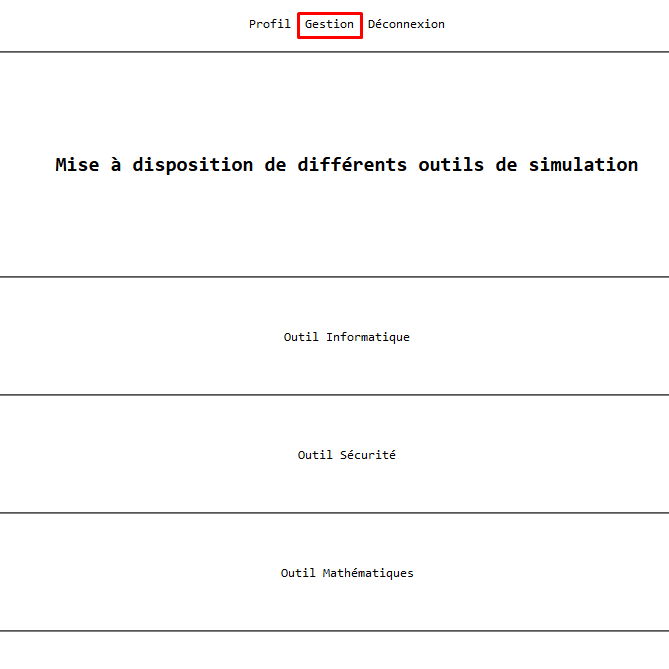
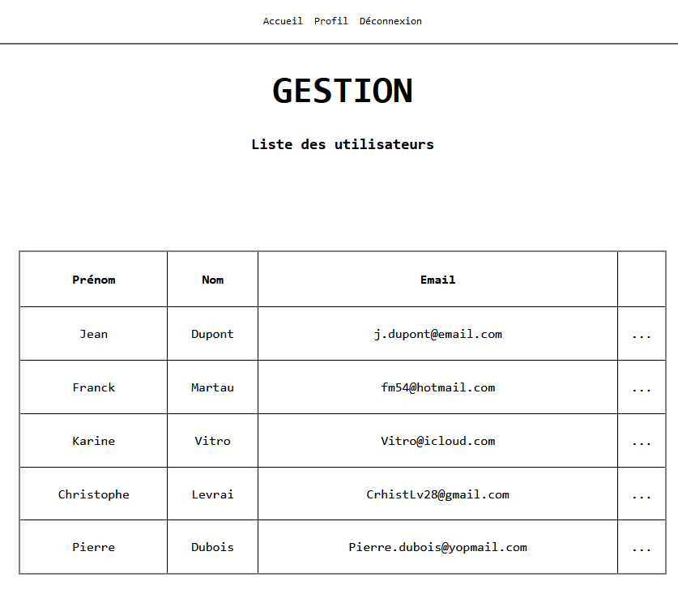
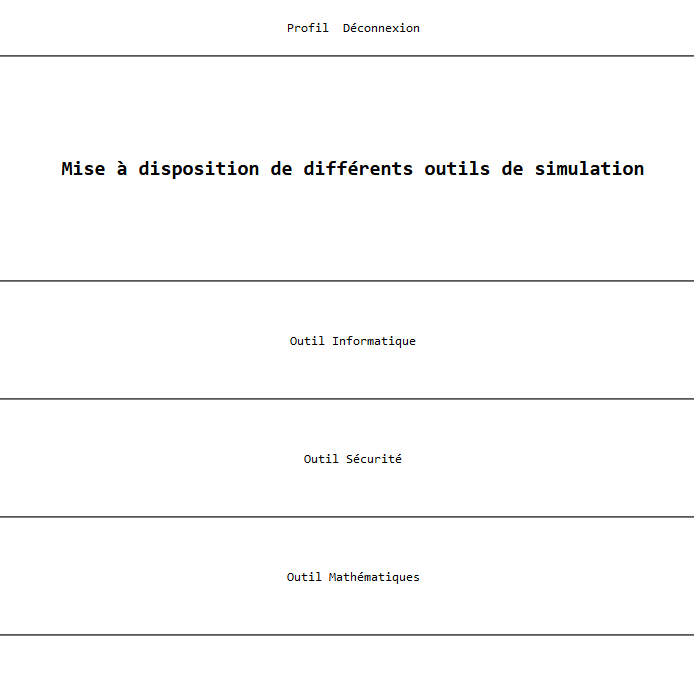
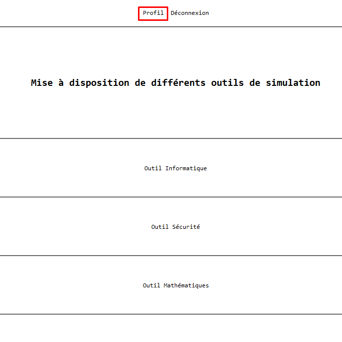
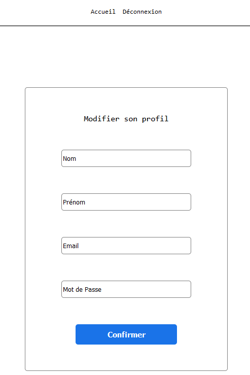
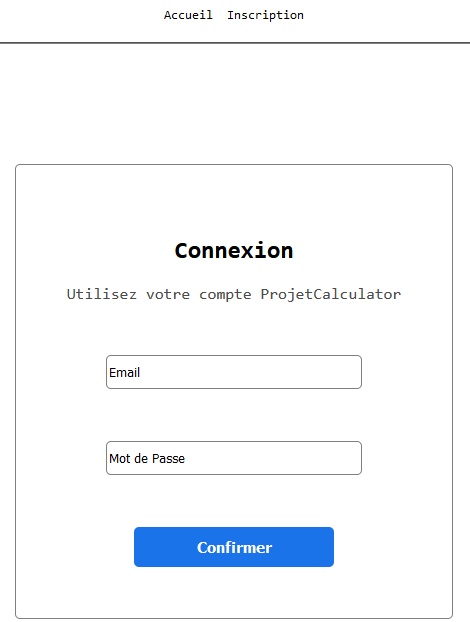
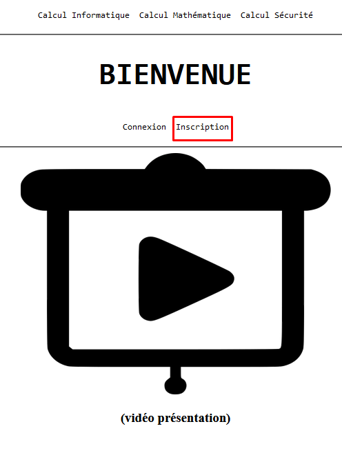
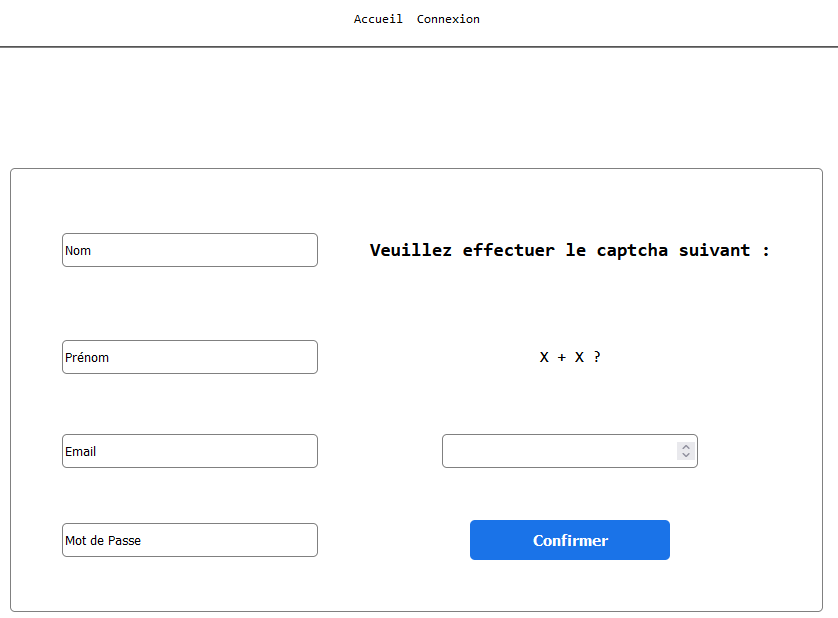
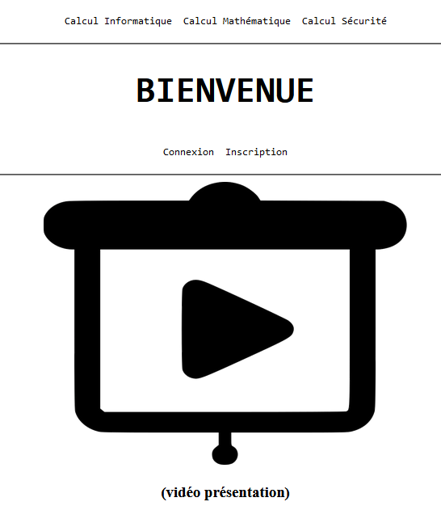

# Document de Tests
**Saé, Semestre 3, Année 2022-2023**
**IUT de Vélizy**,
*Adel Hammiche, Yanis Bouchaib, Paul Montagnac, Esteban Pagis*
## Sommaire:
1. ### Contexte
2. ### Maquette
3. ### Module de Probabilités
4. ### Système d'Inscription
###
1.  # Contexte
    Dans le cadre de la SAÉ consistant à mettre en place une application web permettant l’utilisation de différentes simulations avec un système d’utilisateurs (récit détaillé dans le Cahier des Charges), l’équipe de développement a conçu une maquette en HTML & CSS, qui est la première fondation de notre application.

	Ce document va permettre de regrouper les premiers tests effectués sur cette maquette.

2. # Maquette
	1.  ## Mise en place des tests
	    Les tests mis en place serviront à valider les liens entre les différentes pages à l’aide des boutons disponibles, étant donné que les boutons sont les seuls composants interactifs actuellement présents sur la maquette.

		La page d’accueil et de profil seront testés du point de vue de l’utilisateur, le gestionnaire aura accès aux mêmes pages, avec un bouton “Gestion” ajouté dans la barre de navigation.

	2.  ## Scénarios
	    
		#### Accéder à la page de Gestion
		<u>Contexte</u>: Dans la version finale, l’utilisateur aura un rôle attribué “gestionnaire”, ce rôle débloquera un bouton “Gestion”, visible sur les captures d’écran visibles ci-dessous. Ce test porte sur la liaison entre le bouton et l’affichage de la page associée. 

		Ici, nous nous trouvons sur la page d’accueil, vu par le Gestionnaire. Le bouton Gestion est entouré sur la capture d’écran. 

		En cliquant sur le bouton, la page de Gestion s’affiche avec succès, le lien composant-page est validé.

		---
		#### Accéder à la page d’Accueil
		<u>Contexte</u>: La page d’accueil sera la première page chargée lors de l’authentification de l’utilisateur, ou du chargement du site si les cookies fournissent les détails d’authentification automatique. Le test ne vérifie pas l'interaction avec un bouton, mais l’unique affichage de la page. Dans le cadre de la maquette, nous ouvrirons uniquement le fichier html pour afficher la page.

		Nous constatons l’affichage de la page d’accueil, du point de vue de l’utilisateur.

		---
		#### Accéder à la page Profil
		<u>Contexte</u>: L’utilisateur est dans la page d’accueil, le bouton d’accueil est situé dans la barre de navigation. Le test est mis en place pour valider la liaison entre le bouton Profil et la page profil associée. 

		Nous sommes situés dans la page d’accueil, le bouton Profil est entouré en rouge. 

		La page profil s’affiche avec succès.

		---
		#### Accéder à la page de Connexion
		<u>Contexte</u>:Le visiteur est situé dans la page de bienvenue. L’objectif du test est de vérifier la liaison entre le bouton Connexion (entouré en rouge) et la page de connexion. 

		Nous sommes situés sur la page de bienvenue, le bouton Connexion est entouré en rouge.

		La page de connexion s’affiche avec succès.

		---
		### Accéder à la page d’Inscription
		<u>Contexte</u>:Le visiteur est situé dans la page de bienvenue. L’objectif du test est de vérifier la liaison entre le bouton Inscription (entouré en rouge) et la page d’inscription. 

		Nous sommes situés sur la page de bienvenue, le bouton Inscription est entouré en rouge.

		La page d’inscription s’affiche avec succès

		---
		#### Accéder à la page de Bienvenue
		<u>Contexte</u>: La page de bienvenue sera la première page chargée lors du premier accès à l’application web par un visiteur, ou lors d’un accès à la plateforme d’un utilisateur non-authentifié. Le test ne vérifie pas l'interaction avec un bouton, mais l’unique affichage de la page. Dans le cadre de la maquette, nous ouvrirons uniquement le fichier html pour afficher la page.

		La page de bienvenue s’affiche avec succès.

3. # Module de Probabilités
	1.  ## Mise en place des tests
		Étant donné que nous cherchons à tester le résultat du script python en PHP, nous utiliserons PHPUnit, qui est un framework PHP dédié aux tests unitaires.
		Pour installer PHPUnit, nous téléchargeons le framework archivé au format phar, que nous plaçons dans le répertoire racine du site.
		
		Nous créerons un fichier PHP dédié aux tests (moduleProbaTest.php). Contenant une classe, et différentes fonctions dédiés aux quatres cas d'utilisations.

	2. ## Scénarios
		### L'utilisateur rentre des valeurs valides
		<u>Contexte</u>:L'utilisateur accède au formulaire à remplir et inscrit 3 valeurs valides, il valide ensuite le formulaire.
		
		Pour réaliser ce test, nous vérifions que les valeurs sont égales avec les 3 méthodes:
		```php
		$proba = new probaMethodes();  
		$output1 = $proba->probaRectangleGauche(1, 2, 3);  
		$output2 = $proba->probaTrapeze(1, 2, 3);  
		$output3 = $proba->probaSimpson(1, 2, 3);  
		$this->assertEquals(0.83995, $output1);  
		$this->assertEquals(0.83999, $output2);  
		$this->assertEquals(0.83999, $output3);
		```
		Il est important de préciser que les valeurs sont entrées à la main, en effet, une différence minime est remarquable entre la méthode Rectangle Gauche et les deux autres méthodes.
		
		---
		### L'utilisateur rentre des valeurs invalides
		<u>Contexte</u>:L'utilisateur accède au formulaire à remplir et inscrit 2 valeurs valides, ainsi qu'une valeur invalide (qui n'est pas un nombre).
		
		Pour réaliser ce test, nous vérifions qu'un string est retourné par le script python comme indiqué dans son code.
		```php
		$proba = new probaMethodes();  
		// Méthode Rectangle Gauche  
		$output1 = $proba->probaRectangleGauche(1,2,'char');  
		$output2 = $proba->probaRectangleGauche(1,'char', 3);  
		$output3 = $proba->probaRectangleGauche('char', 2, 3);  
		$this->assertStringContainsString("Les valeurs doivent être des nombres entiers ou décimaux.", $output1);  
		$this->assertStringContainsString("Les valeurs doivent être des nombres entiers ou décimaux.", $output2);  
		$this->assertStringContainsString("Les valeurs doivent être des nombres entiers ou décimaux.", $output3);
		```
		Ces asserts sont également répétés pour les deux autres méthodes.
		
		---
		### Les trois méthodes retournent le même résultat (au 10^3 près)
		<u>Contexte</u>:L'utilisateur accède au formulaire à remplir et inscrit les 3 mêmes valeurs pour les 3 différentes méthodes.
		
		Comme décrit dans le Recueil des Besoins, la valeur est arrondie au troisième chiffre après la virgule, car les résultats différent entre la méthode Rectangle Gauche et Trapèze/Simpson
		```php
		$proba = new probaMethodes();  
		$output1 = round($proba->probaRectangleGauche(1,2,3),3);  
		$output2 = round($proba->probaTrapeze(1,2,3),3);  
		$output3 = round($proba->probaSimpson(1,2,3),3);  
		$this->assertEquals($output1,$output2);  
		$this->assertEquals($output2,$output3);  
		$this->assertEquals($output1,$output3);
		```
		Nous comparons la première valeur et la seconde, la seconde et dernière, ainsi que la première et dernière.

		---
		### L'un ou plusieurs des champs sont vides
		<u>Contexte</u>:L'utilisateur accède au formulaire à remplir et n'inscrit pas toutes les valeurs.
		
		Pour réaliser ce test, nous passons par une condition définie en PHP dans la classe probaMethodes, contenant les différentes méthodes qui exécutent les scripts python.
		```php
		if (empty($variance) || empty($ecart_type) || empty($seuil)) {  
		    return "Veuillez tous remplir les champs.";  
		} else {  
		    ...
		}
		```
		Une fois cette structure définie, nous pouvons écrire notre classe de test.
		```php
		$proba = new probaMethodes();  
		$output1 = $proba->probaRectangleGauche(1,2, "");  
		$output2 = $proba->probaTrapeze(1,2,"");  
		$output3 = $proba->probaSimpson(1,2,"");  
		$this->assertStringContainsString("Veuillez tous remplir les champs.", $output1);  
		$this->assertStringContainsString("Veuillez tous remplir les champs.", $output2);  
		$this->assertStringContainsString("Veuillez tous remplir les champs.", $output3);
		```

4. # Système d'Inscription
	1. ## Mise en place des tests
	Pour mettre en place les tests, nous allons encore utiliser PHPUnit. Les tests seront séparés en deux groupes de tests: les tests unitaires sur les formulaires et les tests unitaires intéragissant avec la base de données.

	Pour les tests interagissant avec la base de données, nous ne pouvions pas les exécuter en local car la base de données est située sur le serveur Raspberry Pi. L'équipe a donc d'abord pensé à Mocker la base de données (créer une base de données fictive pour les tests) en utilisant un framework appelé 'Mockery'. L'installation se faisait avec 'Composer', un gestionnaire de dépendances en PHP permettant d'ajouter différents modules.
	Cependant, l'équipe a décidé de ne pas continuer avec Mockery, les tests ne répondaient pas aux attentes.
	Les tests unitaires qui interagissent avec la base de données ne pourront donc pas être exécutés en local mais fonctionnent sur le Raspberry Pi, en interaction avec notre propre base de données.

	Chaques fonctions de tests nécessiteront l'import du fichier traitementMethodes.php:
	``$traitementMethodes = new traitementMethodes();``

	2. ## Scénarios
		### Validation du Captcha
		<u>Contexte</u>: Le visiteur est sur la page d'accueil pour visiteur, il clique sur le bouton Inscription
		Pour réaliser ce tests, nous instanciant deux objets "reponse", qui sont des array. La structure est fournie par la documentation de l'API reCAPTCHA.
		```php
		$responseValide = (object) array(
            'success' => true,
            'challenge_ts' => '2022-02-28T12:34:56Z',
            'hostname' => 'localhost',
            'score' => 0.9,
            'action' => 'formulaire'
        );

        $responseInvalide = (object) array(
            'success' => false,
            'challenge_ts' => '2022-02-28T12:34:56Z',
            'hostname' => 'localhost',
            'score' => 0.0,
            'action' => 'formulaire'
        );
		```
		La validité des réponses s'effectue dans l'attribut ``'success'``, les autres attributs servent au contexte de la réponse mais ne sont pas essentiels à la condition.
		```php
		$output1 = $traitementMethodes->captchaValide($responseValide);
        $output2 = $traitementMethodes->captchaValide($responseInvalide);
        $this->assertTrue($output1);
        $this->assertFalse($output2);
		```
		Nous associons les différentes réponses de la condition captchaValide (voir Documentation) dans deux valeurs $output1 et $output2 pour tester leur valeurs avec des assert.
		---
		### Les champs sont remplis
		<u>Contexte</u>: Le visiteur est sur la page d'accueil pour visiteur, il clique sur le bouton Inscription
		Pour tester cette condition, nous instancions trois fois la condition:
		- avec les deux champs remplis
		- avec le champ username vide
		- avec le champ password vide
		```php
        $output1 = $traitementMethodes->champsRemplis('test', 'azerty123');
        $output2 = $traitementMethodes->champsRemplis('', 'azerty123');
        $output3 = $traitementMethodes->champsRemplis('test', '');
		```
		pour ensuite vérifier leur validité avec des assert:
		```php
		$this->assertTrue($output1);
        $this->assertFalse($output2);
        $this->assertFalse($output3);
		```
		---
		### Connexion à la base de données
		<u>Contexte</u>: Le visiteur est sur la page d'inscription, il soumet le formulaire d'inscription
		**Ce test unitaire ne peut s'exécuter uniquement sur le Raspberry Pi contenant la base de données associées.**
		La fonction mysqli_connect permet de vérifier le status de la connexion, cependant, nous devons mettre en place un bloc try/catch, car en cas d'erreur de la connexion, une erreur est retournée au lieu d'un false. En cas d'erreur récupérée le bloc catch permet d'associer la valeur false à ``$output2`` et de vérifier son assert.
		```php
		try {
            $output1 = $traitementMethodes->connexionDatabaseReussie(mysqli_connect('localhost', 'root', '@root123', 'PLANETCALCULATOR'));
            $output2 = $traitementMethodes->connexionDatabaseReussie(mysqli_connect('localhost', 'dummy', '@root123', 'PLANETCALCULATOR'));
            $this->assertTrue($output1);
        } catch (Exception $e) {
            $output2 = false;
            $this->assertFalse($output2);
        }
		```
		---
		### L'utilisateur n'est pas déjà inscrit
		<u>Contexte</u>: Le visiteur est sur la page d'inscription, il soumet le formulaire d'inscription
		**Ce test unitaire ne peut s'exécuter uniquement sur le Raspberry Pi contenant la base de données associées.**
		Commençons par nous connecter à mariaDB: ``$connexion = mysqli_connect('localhost', 'root', '@root123', 'PLANETCALCULATOR');``
		Pour vérifier que l'utilisateur n'est pas déjà inscrit, nous effectuons des requêtes destinées à le supprimer de la base de données, si jamais il y est déjà inscrit:
		```php
        $deleteUser = $connexion->prepare("DELETE FROM User WHERE username='test1231231234'");
        $deleteUser->execute();
		```
		Nous pouvons maintenant effectuer la requête destinée à retourner les colonnes qui consignent l'utilisateur en base de données si celui-ci y existe:
		```php
		$state = $connexion->prepare("SELECT id_user, password FROM User WHERE username='test1231231234'");
        $state->execute();
        $state->store_result();
		```
		La réponse de cette requête est ensuite passée en condition pour vérifier que son nombre de colonnes ne soit pas supérieur à 0:
		```php
		$output1 = $traitementMethodes->utilisateurNonInscrit($state);
        $this->assertTrue($output1);
		```

		Pour tester si un utilisateur est déjà inscrit, nous effectuons le même schéma de code, en rajoutant l'utilisateur en base de données:
		```php
		$deleteUser = $connexion->prepare("DELETE FROM User WHERE username='test1231231234'");
        $deleteUser->execute();
        $insertUser = $connexion->prepare("INSERT INTO User (username,password) VALUES ('test1231231234', 'azertyTest1231234')");
        $insertUser->execute();
		```
		Dans ce cas, la requête de ``$deleteuser`` permet de nettoyer la base de données pour éviter un potentiel conflit.
		Nous exécutons ensuite la même requête permettant de trouver si l'utilisateur est en base de données, et vérifions si celle-ci retourne un false car son nombre de colonnes est supérieur à 0:
		```php
		$state = $connexion->prepare("SELECT id_user, password FROM User WHERE username='test1231231234'");
        $state->execute();
        $state->store_result();

        $output2 = $traitementMethodes->utilisateurNonInscrit($state);
        $this->assertFalse($output2);
		```

5. # Système de Connexion
	1. ## Préparation des tests
	Les tests effectués pour l'instant sont les mêmes tests que dans le système d'Inscription étant donné que les mêmes éléments sont réutilisés dans le traitement du formulaire et de la modification du profil, le code ne sera donc pas détaillé. 
	L'ajout d'un test Utilisateur Inscrit sera effectué dans la classe de tests de Profil.

	2. ## Scénario
	### Validation du Captcha
	<u>Contexte</u>: L'utilisateur est sur la page d'accueil pour visiteur, il clique sur le bouton Connexion
	Nous exécutons le test avec la même méthode utilisée pour l'inscription, réecrite dans le fichier traitementMethodes.php.
	**Résultat: OK (1 test, 2 assertions)**
	---
	### Les champs sont remplis
	<u>Contexte</u>: L'utilisateur est sur la page d'accueil pour visiteur, il clique sur le bouton Connexion
	Nous exécutons le test avec la même méthode utilisée pour l'inscription, réecrite dans le fichier traitementMethodes.php.
	**Résultat: OK (1 test, 3 assertions)**
	---
	### Connexion à la base de données
	<u>Contexte</u>: L'utilisateur est sur la page d'inscription, il soumet le formulaire de connexion
	Nous exécutons le test sur le serveur Raspberry Pi contenant la base de données avec la même méthode utilisée pour l'inscription, réecrite dans le fichier traitementMethodes.php.
	**Résultat: OK (1 test, 2 assertions)**
	---
	### Utilisateur inscrit en base de données:
	<u>Contexte</u>: L'utilisateur est sur la page d'inscription, il soumet le formulaire de connexion
	La méthode utilisée pour ce test permet de vérifier qu'une seule colonne est retournée par la requête SQL qui cherche l'utilisateur en base:
	```php
	if ($state->num_rows == 1) {
		return true;
	} else {return false;}
	```
	Sa méthode de test est la même que le test d'utilisateur non-inscrit en base de données, sauf qu'au lieu de vérifier un AssertTrue et un AssertFalse, nous les inversons et vérifions un AssertFalse et AssertTrue:
	```php
	// PREMIER TEST: UTILISATEUR NON-INSCRIT
	$deleteUser = $connexion->prepare("DELETE FROM User WHERE username='test1231231234'");
	$deleteUser->execute();
	$state = $connexion->prepare("SELECT id_user, password FROM User WHERE username='test1231231234'");
	$state->execute();
	$state->store_result();

	$output1 = $traitementMethodes->utilisateurInscrit($state);
	$this->assertFalse($output1);

	// DEUXIEME TEST: UTILISATEUR DEJA INSCRIT:
	$deleteUser = $connexion->prepare("DELETE FROM User WHERE username='test1231231234'");
	$deleteUser->execute();
	$insertUser = $connexion->prepare("INSERT INTO User (username,password) VALUES ('test1231231234', 'azertyTest1231234')");
	$insertUser->execute();
	$state = $connexion->prepare("SELECT id_user, password FROM User WHERE username='test1231231234'");
	$state->execute();
	$state->store_result();

	$output2 = $traitementMethodes->utilisateurInscrit($state);
	$this->assertTrue($output2);
	```