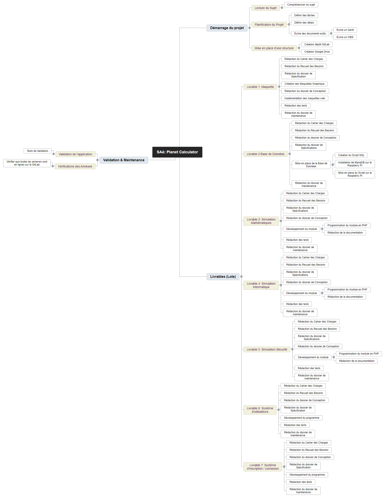

# Rapport d'Organisation du Projet
Saé, Annexe
## Sommaire:
1. ### Introduction
2. ### Planification du Projet
3. ### Cycle de Vie
4. ### Conclusion

###

1. ## Introduction
Ce rapport vise à argumenter l'organisation et la planification de la SAé coordonée par l'équipe pédagogique (F. Hoguin, T. Dufaud, I. Robba) et réalisée par l'équipe de développement (P. Montagnac, E. Pagis, A. Hammiche, Y. Bouchaib).

Nous présenterons les objectifs et livrables définis pour le projet, ainsi que ses documents associés (WBS, Gantt..).

L'objectif de cette SAé est de mettre en place une application web développée en PHP. Cette application web sera hébergée sur un Raspberry Pi et interagira avec une base de données également conçue et hébergée sur le même Raspberry Pi.
Le principe de cette application est de permettre à un utilisateur inscrit d'effectuer des simulations dans 3 domaines différents:  
 1. Informatique
 2. Mathématiques
 3. Autre domaine ou Sécurité

Un gestionnaire (équivalent administrateur) pourra **générer des rapports de statistiques avec des données collectées sur l'utilisation des modules** ainsi que de **visualiser la liste des utilisateurs inscrits** et **supprimer le compte d'un utilisateur**.

Les deux autres types d'utilisateurs sont:
- <u>Le visiteur</u> (utilisateur non-inscrit): qui aura accès à une page d'accueil pour pouvoir s'inscrire ainsi qu'une vidéo de démonstration de l'application. Il ne pourra pas utiliser les simulations sans être inscrit.
- <u>L'utilisateur inscrit</u>: aura accès au différentes simulations et pourra utiliser l'application normalement. Les informations utilisées pour son inscription est son nom d'utilisateur ainsi que son mot de passe, qui sera encrypté lors de l'hébergement sur la base de données.

Le Raspberry Pi utilisé pour l'hébergement du serveur web ainsi que de la base de données sera situé au sein de l'IUT, son accès se fera donc par Tunnel SSH sécurisé.

2. ## Planification du Projet
Pour s'organiser dans ce projet, nous fonctionnerons par rendus sous forme de livrables (ou lot de travail). Cette méthode sera détaillée dans le chapitre suivant destiné à expliquer le cycle de vie utilisé pour ce projet.

Les objectifs de ces livrables sont de fournir une structure composée de plusieurs annexes / documentations (Code, Spécifications, Conception...) pour chaque fonctionnalité ou objectif que propose l'application.
L'équipe de développement propose donc le découpage des tâches en livrables sous la forme suivante:
- Livrable 1: Maquette
- Livrable 2: Base de Données
- Livrable 3: Simulation Mathématiques
- Livrable 4: Simulation Informatique
- Livrable 5: Simulation Sécurité
- Livrable 6: Système d'Utilisateurs
- Livrable 7: Système d'Inscription / Connexion
*\*Le livrable 5 peut être amené à changer en cas de changement de la 3ème simulation*

Un organigramme des tâches du projet (WBS) a été produit par notre équipe pour visualiser le découpage des tâches pour cette SAé:

Le risque principal concerne le respect des délais. L'équipe se devra de respecter les dates de production des livrables pour assurer un bon rythme de développement et éviter les retards sur le projet.

Un diagramme de Gantt a été mis en place pour quantifier les délais accordés aux différents livrables:

Au début de chaque cycle, l'équipe se réparti les tâches pour être le plus dynamique possible sur la réalisation du livrable.

3. ## Cycle de Vie
Le cycle que l'équipe de développement a souhaité choisir est le "**Scrum**". Le Scrum est une méthode Agile qui utilise un cycle de vie incrémental. Chaque incrémentation du cycle est appelé "sprint", la durée d'un cycle a été définie de 2 semaines par l'équipe de développement. 

À chaque début de sprint, l'équipe fixe les objectifs et se répartie les tâches. À la fin du sprint, un livrable est produit.

4. ## Conclusion
Les moyens que nous avons présentés sont mis en places pour ce projets et respectés à ce jour. 
Ils nous sont très utiles pour éviter de nous éparpiller sur les différents sujets, dans un projet ou le découpage de l'emploi du temps n'est pas le même du à l'alternance en entreprise.
